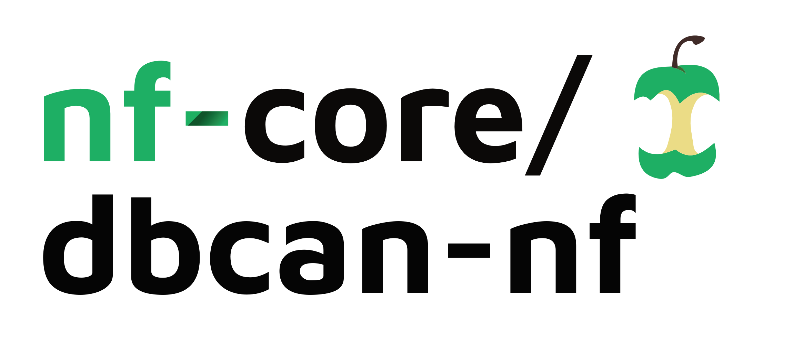

<h1>
  <picture>
    <source media="(prefers-color-scheme: dark)" srcset="docs/images/nf-core-dbcan-nf_logo_dark.png">
    
  </picture>
</h1>

[](https://www.nextflow.io/)
[](https://docs.conda.io/en/latest/)
[](https://www.docker.com/)
[](https://sylabs.io/docs/)


## Introduction

**dbcan-nf** is a bioinformatics pipeline for carbohydrate-active enzyme (CAZyme) annotation and analysis in microbiome data. The pipeline implements the protocol described in "Carbohydrate-active enzyme annotation in microbiomes using dbCAN" (bioRxiv) and supports three analysis modes:

> 📖 **Full Documentation**: Complete documentation with detailed guides, parameter references, and example results is available at [run-dbcan.readthedocs.io](https://run-dbcan.readthedocs.io/en/latest/nextflow/index.html).

- **Short reads**: Assembly-based analysis using MEGAHIT for short-read metagenomic data
- **Long reads**: Assembly-based analysis using Flye for long-read metagenomic data  
- **Assembly free**: Direct annotation without assembly using DIAMOND blastx

The pipeline performs quality control, optional taxonomic filtering, gene prediction (for assembly-based modes), CAZyme annotation using dbCAN, abundance calculation, and visualization.

The pipeline is built using [Nextflow](https://www.nextflow.io/) and processes data using the following steps:

1. Read QC ([`FastQC`](https://www.bioinformatics.babraham.ac.uk/projects/fastqc/))
2. Read trimming ([`TrimGalore`](https://www.bioinformatics.babraham.ac.uk/projects/trim_galore/))
3. Optional taxonomic filtering ([`Kraken2`](https://ccb.jhu.edu/software/kraken2/))
4. Assembly (for short/long reads modes) or direct annotation (assembly free mode)
5. CAZyme annotation ([`dbCAN`](https://bcb.unl.edu/dbCAN2/))
6. Abundance calculation and visualization
7. Present QC for raw reads ([`MultiQC`](http://multiqc.info/))

## Usage

> [!NOTE]
> If you are new to Nextflow, please refer to the [Nextflow documentation](https://www.nextflow.io/docs/latest/getstarted.html) on how to set-up Nextflow. Make sure to test your setup with `-profile test` before running the workflow on actual data.

> 📚 **Comprehensive Documentation**: For detailed usage instructions, parameter descriptions, analysis modes, and example results, please visit the [dbcan-nf documentation](https://run-dbcan.readthedocs.io/en/latest/nextflow/index.html) on ReadTheDocs.

### Installation

First, clone the repository:

```bash
git clone <repository-url>
cd dbcan-nf
```

### Running the pipeline

First, prepare a samplesheet with your input data that looks as follows:

`samplesheet.csv`:

```csv
sample,fastq_1,fastq_2
CONTROL_REP1,AEG588A1_S1_L002_R1_001.fastq.gz,AEG588A1_S1_L002_R2_001.fastq.gz
```

Each row represents a fastq file (single-end) or a pair of fastq files (paired end).

Now, you can run the pipeline using:

```bash
nextflow run main.nf \
   -profile <docker/singularity/conda> \
   --input samplesheet.csv \
   --outdir <OUTDIR>
   --skip_kraken_extraction # based on the database size of kraken2, you can skip this step if the database is too large.
```

> [!WARNING]
> Please provide pipeline parameters via the CLI or Nextflow `-params-file` option. Custom config files including those provided by the `-c` Nextflow option can be used to provide any configuration _**except for parameters**_.

## Pipeline output

For more details about the output files and reports, please refer to the output documentation in the `docs/` directory.

## Credits

dbcan-nf was originally written by Xinpeng Zhang; Haidong Yi; Jinfang Zheng; Yanbin Yin.

We thank the following people for their extensive assistance in the development of this pipeline:

<!-- TODO: If applicable, make list of people who have also contributed -->

### Acknowledgments

This pipeline is built using the [nf-core](https://nf-co.re/) workflow framework. We thank the nf-core community for providing excellent templates and best practices for Nextflow pipeline development.

## Contributions and Support

If you would like to contribute to this pipeline, please see the [contributing guidelines](.github/CONTRIBUTING.md).

For further information or help, please open an issue on the GitHub repository.

## Citations

<!-- TODO: Add citation for pipeline after first release. Uncomment lines below and update Zenodo doi. -->
<!-- If you use dbcan-nf for your analysis, please cite it using the following doi: [10.5281/zenodo.XXXXXX](https://doi.org/10.5281/zenodo.XXXXXX) -->

<!-- TODO: Add bibliography of tools and data used in your pipeline -->

An extensive list of references for the tools used by the pipeline can be found in the [`CITATIONS.md`](CITATIONS.md) file.

This pipeline is built using the nf-core framework. If you use this pipeline, please cite the `nf-core` publication as follows:

> **The nf-core framework for community-curated bioinformatics pipelines.**
>
> Philip Ewels, Alexander Peltzer, Sven Fillinger, Harshil Patel, Johannes Alneberg, Andreas Wilm, Maxime Ulysse Garcia, Paolo Di Tommaso & Sven Nahnsen.
>
> _Nat Biotechnol._ 2020 Feb 13. doi: [10.1038/s41587-020-0439-x](https://dx.doi.org/10.1038/s41587-020-0439-x).
